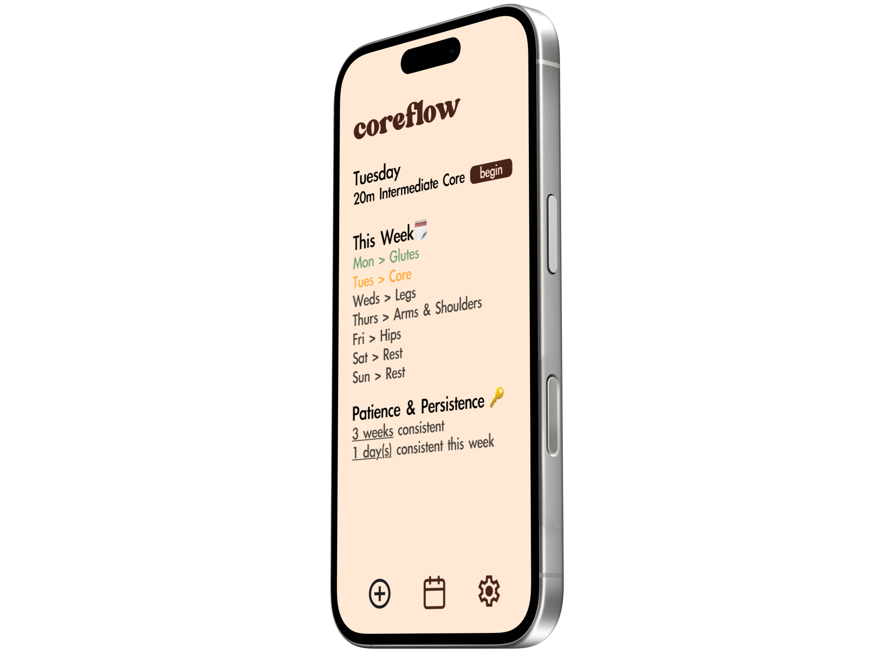
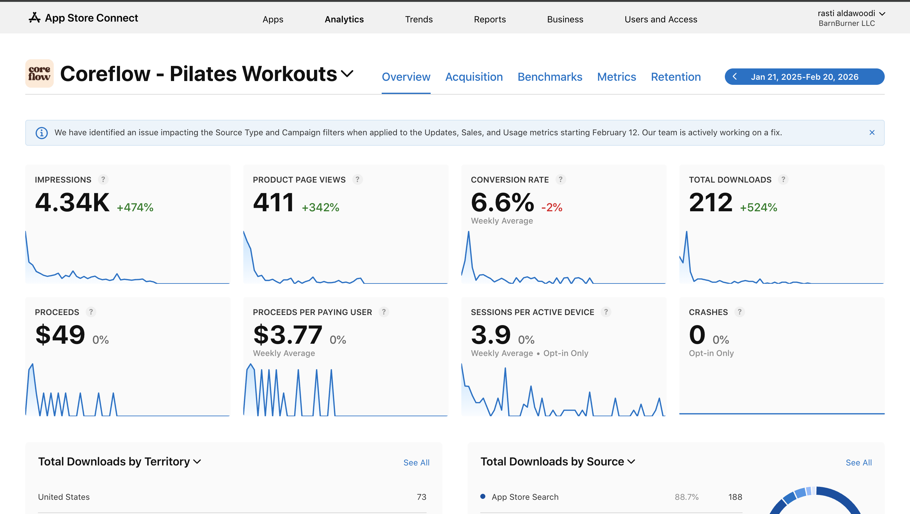
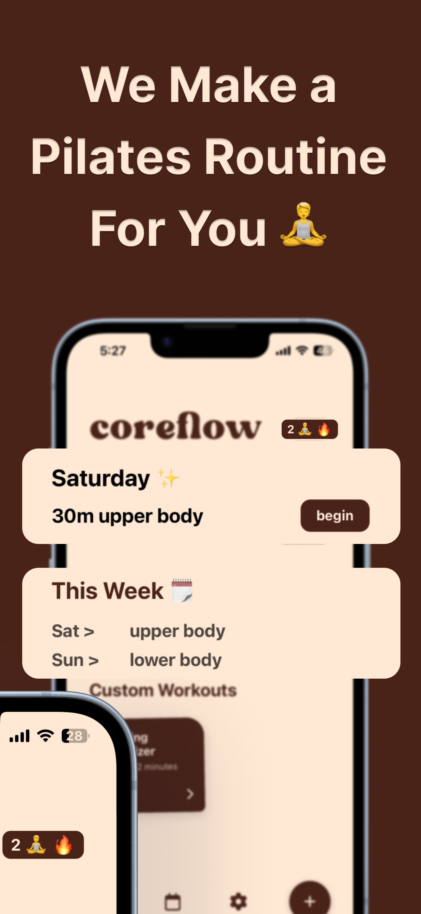
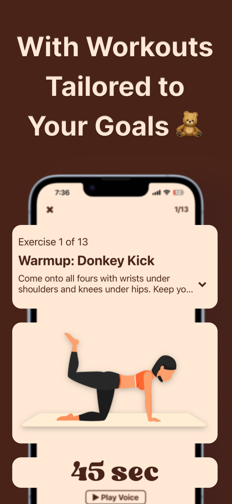
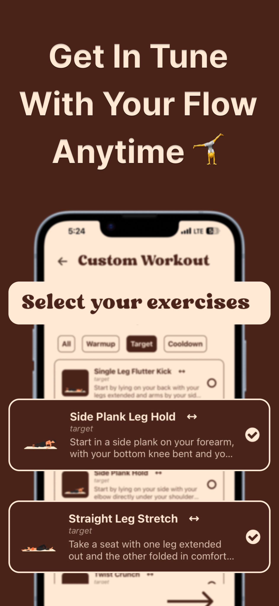
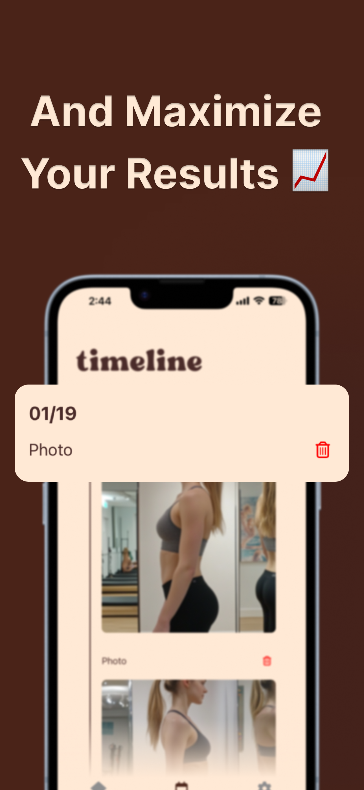
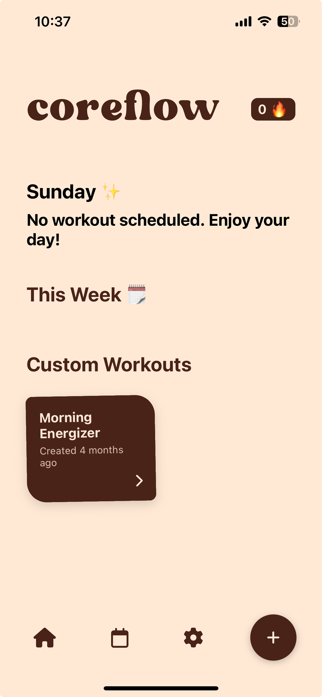

<div align="center">

# Coreflow

### Your Personal Pilates Studio

A beautifully crafted iOS app for guided pilates workouts, progress tracking, and building a consistent practice.

[](https://reactnative.dev/)
[](https://expo.dev/)
[](https://supabase.com/)
[](https://www.typescriptlang.org/)
[](https://apps.apple.com/)

<br />

<!-- Replace with actual App Store screenshot or hero image -->


<br />

[**Download on the App Store**](#) · [**Watch Demo**](#) · [**Website**](#)

</div>

<br />

---

## Why Coreflow?

Pilates was [the most-booked workout globally in 2024](https://insider.fitt.co/pilates-2024s-most-popular-workout/) — topping ClassPass rankings for the second consecutive year with an 84% rise in bookings. Studios are expensive. YouTube is overwhelming. Coreflow was built to give everyone access to structured, progressive pilates sessions they can do from anywhere — no reformer required.

<br />

## Revenue

Coreflow reached **~$50 MRR** on the App Store through its subscription model before my co-founder departed and we discontinued the project. The app validated real demand for a focused, well-designed pilates experience in a market seeing explosive growth.

<div align="center">

<br />
<sub><b>App Store Connect — 4.34K impressions, 212 downloads, $49 in proceeds, 6.6% conversion rate</b></sub>
</div>

<br />

## Screenshots

<!-- Replace these placeholders with actual screenshots -->

<div align="center">
<table>
<tr>
<td align="center"><br /><sub><b>Welcome</b></sub></td>
<td align="center"><br /><sub><b>Daily Session</b></sub></td>
<td align="center"><br /><sub><b>Guided Workout</b></sub></td>
<td align="center"><br /><sub><b>Custom Workouts</b></sub></td>
</tr>
<tr>
<td align="center"><br /><sub><b>Progress Timeline</b></sub></td>
<td align="center"><br /><sub><b>Home Screen</b></sub></td>
</tr>
</table>
</div>

<br />

## Demo

<!-- Replace with actual video link (Loom, YouTube, etc.) -->

<div align="center">

[](# "Click to watch demo")

</div>

<br />

## Features

**Structured Workouts**
- Guided pilates sessions with animated exercise demonstrations
- Focus areas: full body, upper body, lower body, and core
- Flexible durations: 5, 10, 15, or 20+ minute sessions
- Beginner, intermediate, and advanced difficulty levels

**Custom Routines**
- Build personalized workouts from the exercise library
- Set individual exercise durations with drag-and-drop ordering
- Save and reuse your favorite custom routines

**Progress Tracking**
- Daily streak system with unlockable milestone levels
- Progress photo timeline with before/after comparisons
- Mood tracking to connect how you feel with your practice
- Weekly consistency metrics and session history

**Smart Scheduling**
- Set your weekly frequency: 3x, 5x, or every day
- Configurable reminder notifications
- Timezone-aware scheduling that adapts when you travel

**Subscription Model**
- Freemium access with premium features behind a paywall
- Managed via [Superwall](https://superwall.com/) for A/B tested paywalls

<br />

## Tech Stack

| Layer | Technology |
|-------|-----------|
| **Framework** | React Native + Expo (SDK 52) |
| **Language** | TypeScript |
| **Navigation** | Expo Router (file-based routing) |
| **Backend** | [Supabase](https://supabase.com/) (PostgreSQL, Auth, Edge Functions, Storage) |
| **Auth** | Phone OTP, Apple Sign-In, Google OAuth |
| **Payments** | Superwall |
| **Analytics** | PostHog |
| **Animations** | Lottie |
| **Builds** | EAS (Expo Application Services) |

<br />

## Architecture

```
app/                    # Screens (Expo Router file-based routing)
├── welcome.tsx         # Landing page
├── login.tsx           # Phone OTP authentication
├── onboarding.tsx      # Multi-step onboarding wizard
└── (app)/(tabs)/       # Authenticated tab navigation
    ├── home/           # Daily session, custom workouts, active session
    ├── timeline.tsx    # Progress photo & mood history
    └── settings/       # Preferences, subscription, routine config

components/             # 40+ reusable UI components
lib/                    # Business logic, Supabase client, utilities
supabase/
├── migrations/         # 31 database migrations
├── functions/          # Edge functions (auth, notifications, scheduling)
└── seed.sql            # Exercise library seed data
```

### Backend — Supabase

The entire backend runs on [Supabase](https://supabase.com/):

- **PostgreSQL** — Relational schema for users, sessions, exercises, progress entries, and streak tracking
- **Auth** — Phone OTP, Apple Sign-In, and Google OAuth with automatic token refresh
- **Edge Functions** — Serverless TypeScript functions for auth verification, push notifications, and schedule management
- **Storage** — Progress photo uploads
- **Row Level Security** — All tables protected with per-user RLS policies

<br />

## Getting Started

### Prerequisites

- Node.js 18+
- iOS Simulator or physical device
- [Expo CLI](https://docs.expo.dev/get-started/installation/)
- Supabase project (for backend)

### Installation

```bash
# Clone the repo
git clone https://github.com/rasti-najim/coreflow.git
cd coreflow

# Install dependencies
npm install

# Set up environment variables
cp .env.example .env.local
# Fill in your Supabase URL, anon key, and other service keys

# Start the development server
npx expo start
```

### Environment Variables

| Variable | Description |
|----------|-------------|
| `EXPO_PUBLIC_SUPABASE_URL` | Supabase project URL |
| `EXPO_PUBLIC_SUPABASE_ANON_KEY` | Supabase anonymous key |
| `EXPO_PUBLIC_GOOGLE_CLIENT_ID` | Google OAuth client ID |
| `EXPO_PUBLIC_SUPARWALL_PUBLIC_KEY` | Superwall public key |
| `EXPO_PUBLIC_POSTHOG_API_KEY` | PostHog analytics key |

<br />

## Color Palette

| Color | Hex | Usage |
|-------|-----|-------|
|  | `#FFE9D5` | Primary background |
|  | `#4A2318` | Primary text |
|  | `#3D1D1D` | Logo & branding |
|  | `#4A2D1E` | Dark overlays |

<br />

## License

This project is source-available for portfolio and educational purposes. Not licensed for redistribution or commercial use.

<br />

---

<div align="center">

Built by [**Rasti Aldawoodi**](https://github.com/rasti-najim)

</div>
